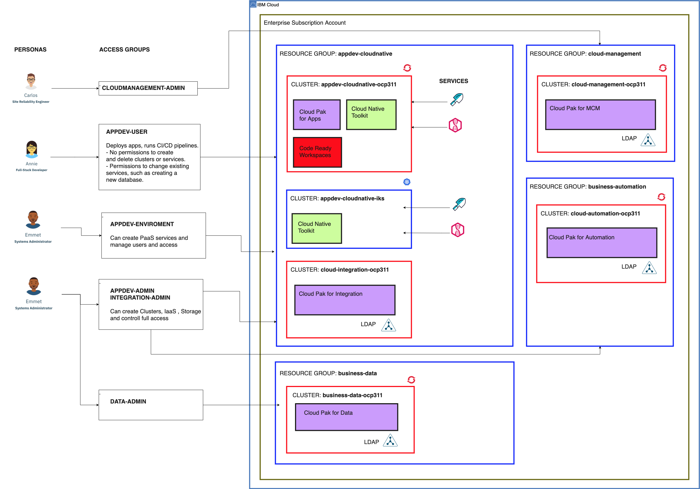
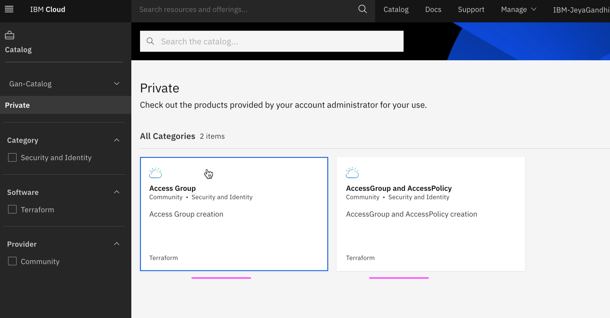
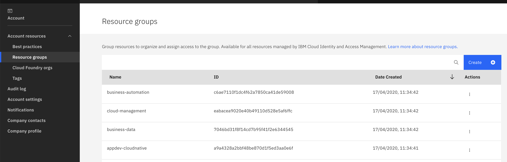
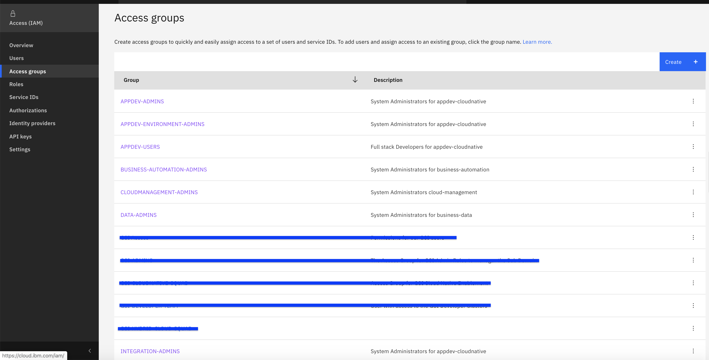
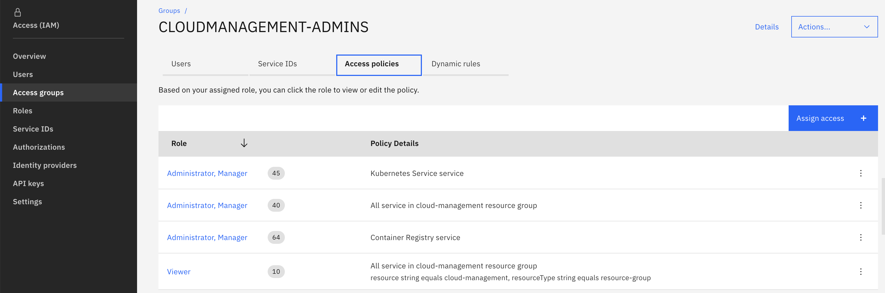
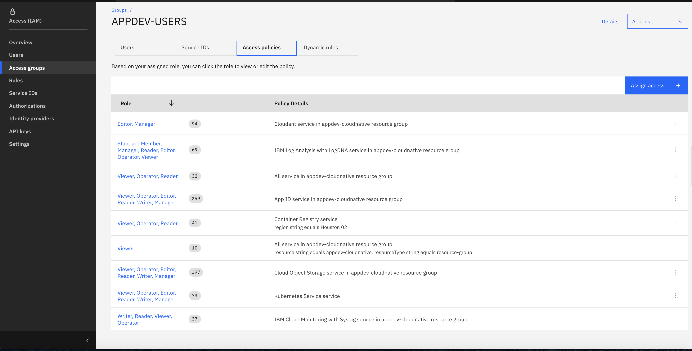

# IBM Cloud GSI Sandbox - Private Catalog tiles

The below IAM objects are recommented for any Sandboxes that are created in IBM Cloud.

```
    Resource Group
    Access Group
    Assign Users to Access Group
    Assign Access Policies to Access Group
```

This project provides the below private catalog tiles which would create the required IAM objects for the Sandboxes.

```
    Resource Group
    Access Group and Access Policies
    Assign Users to Access Group
```




## 1. View Private Catalog Tiles. 

Here are the steps to view the Private Catalog tiles.

<details><summary>CLICK ME</summary>

1. Click on `Catalog` in ibm cloud web console.

<br></br>

2. Choose the `Sangbox-Catalog` menu.

<br></br>

3. It shows the 3 tiles that we created.


<br></br>

</details>


## 2. Run Tile 

Here are the steps to run the tiles.

<details><summary>CLICK ME</summary>

### 1. Run Tile - Resource Group

1. Click on `Resource Group` tile listed in the `Sandbox-Catalog` private catalog 

<br></br>

2. It shows the tile details page.  Click on `Install` link. 

It creates the default resource groups.

<br></br>

<br></br>

### 1. Run Tile - Resource Group

1. Click on `Resource Group` tile listed in the `Sandbox-Catalog` private catalog 

<br></br>

2. It shows the tile details page.  Click on `Install` link. 

It creates the default resource groups.

<br></br>

### 2. Install your clusters.

Install the required clusters.

<br></br>

### 3. Run Tile - Access Group and Access Policies

1. Click on `Access Group and Access Policies` tile listed in the `Sandbox-Catalog` private catalog 

<br></br>

2. It shows the tile details page.  Click on `Install` link. 

It creates the default access groups and assign access polcies.

<br></br>


### 3. Run Tile - Assign User to Access Group

1. Click on `Assign User to Access Group` tile listed in the `Sandbox-Catalog` private catalog 

<br></br>

2. It shows the tile details page.

You can enter email ids in `admins` and `users` section.

3. Click on `Install` link. 

It assigns users to the access groups.

<br></br>

</details>


# 3. IAM Objects

The below diagram describes the various objects created by these tiles.

<details><summary>CLICK ME</summary>


</details>

Here is the list of objects created by default.

### Resource Groups

<details><summary>CLICK ME</summary>

The below resource groups are cretaed. 

```
    appdev-cloudnative
    cloud-management
    business-data
    business-automation
```

IBM Cloud IAM screen with the created resource groups



</details>

### Access Groups

<details><summary>CLICK ME</summary>

The below access Groups are cretaed. 

```
    CLOUDMANAGEMENT-ADMINS
    APPDEV-ADMINS
    APPDEV-ENVIRONMENT-ADMINS
    APPDEV-USERS
    INTEGRATION-ADMINS
    DATA-ADMINS
    AUTOMATION-ADMINS
```

IBM Cloud IAM screen with the created access groups



</details>


### Access Policies

<details><summary>CLICK ME</summary>

The below access Policies are cretaed. 

For all ADMIN groups 

```
-   Resource Group  - 40
-   Resource Group  - 10
-   Kubernetes - 45
-   Container Registery - 64
```

For all USERS groups

```
-   Resource Group - 32
-   Resource Group - 10
-   Kubernetes - 73
-   Kubernetes - 73 with IKS instance
-   Kubernetes - 73 with OCP instance
-   Container Registery - 41
-   Cloudant - 94
-   COS - 197
-   SysDig - 37
-   LogDNA - 69
-   AppID - 259
```
IBM Cloud IAM screen with the created access Policies



The figures above shows the default access policies added to the access group `CLOUDMANAGEMENT-ADMINS`.



The figures above shows the default access policies added to the access group `APPDEV-USERS`.

</details>

### Clusters

<details><summary>CLICK ME</summary>

By default 5 clusters are installed, one for each cloud pak.
```
    Cloud Pak for Application
    Cloud Pak for Integration
    Cloud Pak for Multicloud Management
    Cloud Pak for Automation
    Cloud Pak for Data
```

</details>

# 5. References

#### How to create Private Catalog tiles.

How to create private catalog and tiles are detailed explained in the below docmentation.

https://github.com/GandhiCloudLab/ibm-cloud-private-catalog-iam-ag

